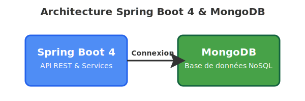

<div align="center">

# 🚀 Demo Spring Boot 4 & MongoDB

[](https://openjdk.org/)
[](https://spring.io/projects/spring-boot)
[](https://www.mongodb.com/)

**Optimisation extrême du démarrage Spring Boot avec AppCDS et Project Leyden**

*Réduction jusqu'à 89.6% du temps de démarrage*

</div>

---

## 📊 Architecture



<div align="center">

### 🏗️ Stack Technique

</div>

| Composant | Description |
|-----------|-------------|
| **🌱 Spring Boot 4** | API REST, gestion des services, mapping DTO/Entity (MapStruct) |
| **🍃 MongoDB** | Base de données NoSQL pour le stockage des données |

---

## 📋 Prérequis

```yaml
Java:
  - Java 25 LibericaJDK (sdk use java 25-librca)
  - Java 26 Leyden - branche premain (sdk use java 26-leyden)
MongoDB: 7.x (recommandé)
```

---

## 🐳 Démarrer MongoDB avec Docker

Lancez rapidement une instance MongoDB avec la commande suivante :

```bash
docker network create app-network
docker run --name demo-mongo -d -p 27017:27017 --network app-network mongo:7
```

> ✅ Cette commande crée un conteneur MongoDB accessible sur le port **27017**

---

## ⚡ Booster le démarrage de votre application Spring Boot

Ce projet démontre **deux solutions puissantes** pour réduire drastiquement le temps de démarrage des applications Spring Boot.

### 🎯 Solution 1 : AppCDS (Application Class-Data Sharing)

<details open>
<summary><b>Cliquez pour voir les détails</b></summary>

**AppCDS** permet de générer un cache de classes partagées pour accélérer le démarrage en évitant le rechargement et la vérification des classes à chaque démarrage.

#### 🔧 Modes disponibles

| Mode | Description | Gain attendu |
|------|-------------|--------------|
| 🔹 **Sans Spring AOT** | Optimisation standard | ~51% |
| 🔸 **Avec Spring AOT** | Optimisation maximale avec pré-compilation | ~54% |

#### 💻 Démo avec le script `build-cds.sh`

```bash
# Sans Spring AOT
./build-cds.sh false

# Avec Spring AOT
./build-cds.sh true
```

</details>

---

### 🚀 Solution 2 : Leyden Cache AOT (Project Leyden)

<details open>
<summary><b>Cliquez pour voir les détails</b></summary>

**Project Leyden** est un projet expérimental d'OpenJDK qui représente **le futur de Java** en matière d'optimisation du démarrage. La branche `premain` permet de précompiler et de mettre en cache les métadonnées pour un démarrage ultra-rapide.

> 🔬 **Note importante** : Pour cette démonstration, j'ai compilé le JDK depuis le projet Leyden (branche `premain`) afin de faire un pas dans le futur de l'optimisation Java.

#### ⚙️ Configuration requise

Pour utiliser Leyden, vous devez avoir accès à un build du JDK Leyden :

```bash
sdk use java 26-leyden
```

#### 🔧 Modes disponibles

| Mode | Description | Gain attendu |
|------|-------------|--------------|
| 🔹 **Sans Spring AOT** | Optimisation Leyden pure | ~65-82% |
| 🔸 **Avec Spring AOT** | Combinaison ultime pour des performances exceptionnelles | **~90%** |

#### 💻 Démo avec le script `build-leyden-aot.sh`

```bash
# Sans Spring AOT
./build-leyden-aot.sh false

# Avec Spring AOT
./build-leyden-aot.sh true
```

</details>

---

## 📈 Comparaison des performances

> 🖥️ **Tests réalisés sur MacBook Pro**
>
> | Spécification | Valeur |
> |---------------|--------|
> | **Modèle** | MacBook Pro |
> | **RAM** | 16 GB |
> | **Architecture** | x86_64 |
> | **CPU cores** | 8 |
> | **macOS** | 13.7.8 |

### 📊 Résultats des Tests - DemoApplication

#### 🥇 Première Série de Tests (Java 25 - LibericaJDK)

> 📦 **JDK Standard** : Cette série de tests utilise **Java 25 LibericaJDK**, une distribution stable et performante de Java.
>
> **Commande utilisée pour activer Java 25 :**
> ```bash
> sdk use java 25-librca
> ```

| Configuration | ⏱️ Temps de Démarrage | ⚙️ Temps Processus | 📊 Amélioration vs Baseline |
|---------------|----------------------|-------------------|----------------------------|
| 🔴 JAR standard | 3.005s | 3.601s | Baseline |
| 🟡 JAR décompressé | 2.591s | 2.897s | 🟢 **-13.8%** |
| 🟠 CDS seul | 1.461s | 1.665s | 🟢 **-51.4%** |
| 🟠 CDS + Spring AOT | 1.395s | 1.597s | 🟢 **-53.6%** |
| 🔵 Cache AOT seul | 1.063s | 1.330s | 🟢 **-64.6%** |
| 🟣 Cache AOT + Spring AOT | 0.720s | 0.963s | 🟢 **-76.0%** |

#### 🏆 Seconde Série de Tests (Java 26 - Project Leyden)

> 🧪 **JDK Expérimental** : Pour cette série, le JDK utilisé est une version expérimentale que j'ai compilée depuis le **Project Leyden (branche premain)**. Cela permet de faire un pas dans le futur de Java et de comparer les résultats avec les optimisations Leyden de nouvelle génération.
>
> **Commande utilisée pour activer le JDK Leyden :**
> ```bash
> sdk use java 26-leyden
> ```

| Configuration | ⏱️ Temps de Démarrage | ⚙️ Temps Processus | 📊 Amélioration vs Baseline |
|---------------|----------------------|-------------------|----------------------------|
| 🔴 JAR standard | 3.215s | 3.948s | Baseline |
| 🔵 Cache AOT seul | 0.578s | 0.767s | 🟢 **-82.0%** |
| 🏆 Cache AOT + Spring AOT | **0.333s** | **0.494s** | 🎉 **-89.6%** |

---

### 🎯 Synthèse des Gains

<div align="center">

| Solution | Gain de Performance | Verdict |
|----------|---------------------|---------|
| 🟡 **JAR décompressé** | ~14% | Gain modeste |
| 🟠 **CDS** | ~51% | 🔥 Réduction significative |
| 🔵 **Cache AOT** | ~65-82% | 🚀 Performance exceptionnelle |
| 🏆 **Cache AOT + Spring AOT** | **~89.6%** | 🎉 **OPTIMAL** |

</div>

---

### 🔬 Analyse des Résultats

Les résultats démontrent clairement l'impact des différentes optimisations :

#### 1️⃣ **AppCDS** - La base solide
- ✅ Amélioration substantielle avec **plus de 50%** de réduction
- ✅ Facile à mettre en œuvre
- ✅ Compatible avec toutes les applications Java

#### 2️⃣ **Project Leyden (Cache AOT)** - Le bond en avant
- ✅ Performances poussées encore plus loin avec **65-82%** de réduction
- ✅ Représente le futur de l'optimisation Java
- ✅ Résultats impressionnants même sans Spring AOT

#### 3️⃣ **Cache AOT + Spring AOT** - La combinaison ultime
- 🎯 Démarrage en **0.333s** (contre 3.215s initialement)
- 🎯 Temps processus total de **0.494s** (contre 3.948s)
- 🎯 **89.6% de réduction** du temps de démarrage total

<div align="center">

### 🌟 Résultat Final

```
     3.948s  ━━━━━━━━━━━━━━━━━━━━━━━━━━━━━  (100%)
        ⬇️
     0.494s  ━━━  (12.5%)

     Gain: 87.5% du temps économisé !
```

</div>

> 💡 **Conclusion** : Project Leyden représente véritablement **le futur de l'optimisation** du démarrage des applications Java.

---


<div align="center">

**Fait avec ❤️ pour optimiser vos applications Java**

[](https://github.com)

</div>
