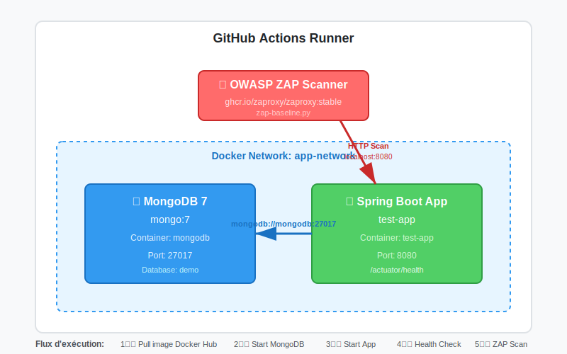

# Exercice 8 : Ajouter les Tests DAST

[⬅️ Exercice précédent](Exercice-07.md) | [🏠 Sommaire](README.md) | [Exercice suivant ➡️](Exercice-09.md)

---

## 🎯 Objectif

Tester l'application en cours d'exécution avec OWASP ZAP pour détecter les vulnérabilités runtime (DAST).

## 🏗️ Architecture DAST

<div align="center">
  
</div>

**Description** : Le workflow DAST démarre MongoDB 7 et l'application Spring Boot dans un réseau Docker partagé, puis OWASP ZAP scanne l'application pour détecter les vulnérabilités de sécurité.

## ⏱️ Durée Estimée

45 minutes

---

## 📝 Instructions

### Étape 8.1 : Créer le workflow DAST

Créez `.github/workflows/dast-zap-test.yml` :

```yaml
on:
  workflow_call:
    secrets:
      DOCKERHUB_USERNAME:
        required: true
      DOCKERHUB_TOKEN:
        required: true
      DEPLOY_APPLI_NAME:
        required: true
      MONGODB_COLLECTION_NAME:
        required: false

permissions:
  contents: read

jobs:
  dast-zap-test:
    name: 🧪 DAST ZAP Test
    runs-on: ubuntu-latest
    steps:
      - name: Checkout code
        uses: actions/checkout@v4

      - name: Login to Docker Hub
        uses: docker/login-action@v3
        with:
          username: ${{ secrets.DOCKERHUB_USERNAME }}
          password: ${{ secrets.DOCKERHUB_TOKEN }}

      - name: Pull Docker image from Docker Hub
        run: docker pull ${{ secrets.DOCKERHUB_USERNAME }}/${{ secrets.DEPLOY_APPLI_NAME }}:${{ github.sha }}

      - name: Create Docker network
        run: docker network create app-network

      - name: Start MongoDB 7 container
        run: |
          docker run -d --name mongodb \
            --network app-network \
            -e MONGO_INITDB_DATABASE=${{ secrets.MONGODB_COLLECTION_NAME || 'demo' }} \
            mongo:7

      - name: Wait for MongoDB to be ready
        run: |
          timeout 30 sh -c 'until docker exec mongodb mongosh --eval "db.adminCommand({ping:1})" > /dev/null 2>&1; do sleep 2; done'

      - name: Run application container
        run: |
          docker run -d --name test-app \
            --network app-network \
            -p 8080:8080 \
            -e SPRING_DATA_MONGODB_URI=mongodb://mongodb:27017/${{ secrets.MONGODB_COLLECTION_NAME || 'demo' }} \
            ${{ secrets.DOCKERHUB_USERNAME }}/${{ secrets.DEPLOY_APPLI_NAME }}:${{ github.sha }}

      - name: Wait for application to be ready
        run: |
          timeout 90 sh -c 'until curl -f http://localhost:8080/actuator/health; do sleep 2; done'

      - name: Create ZAP reports directory
        run: |
          mkdir -p ${{ github.workspace }}/zap-reports
          mkdir -p /tmp/zap-home
          chmod -R 777 ${{ github.workspace }}/zap-reports
          chmod -R 777 /tmp/zap-home

      - name: Run OWASP ZAP DAST scan (Docker direct)
        run: |
          docker run --rm \
            -v ${{ github.workspace }}/zap-reports:/zap/wrk/:rw \
            -v /tmp/zap-home:/home/zap:rw \
            --network=host \
            ghcr.io/zaproxy/zaproxy:stable \
            zap-baseline.py \
            -t http://localhost:8080 \
            -r zap-report.html
        continue-on-error: true

      - name: Upload ZAP reports
        if: always()
        uses: actions/upload-artifact@v4
        with:
          name: zap-scan-reports
          path: |
            zap-reports/zap-report.html

      - name: Stop test containers
        if: always()
        run: |
          docker stop test-app mongodb || true
          docker rm test-app mongodb || true
          docker network rm app-network || true
```

### Étape 8.2 : Ajouter au pipeline principal

**Important** : DAST ne s'exécute PAS sur les Pull Requests (trop long).

Modifiez `main-pipeline.yml` pour ajouter le job DAST après la publication sur Docker Hub :

```yaml
  publish-docker-hub:
    needs: [build-and-scan-docker]
    uses: ./.github/workflows/publish-docker-hub.yml
    secrets: inherit

  # ═══════════════════════════════════════════════
  # ÉTAPE 8 : DAST (Après publication Docker Hub)
  # ═══════════════════════════════════════════════
  dast-zap-test:
    needs: publish-docker-hub
    uses: ./.github/workflows/dast-zap-test.yml
    secrets: inherit
```

**Note** : DAST s'exécute après `publish-docker-hub` car il doit pull l'image depuis Docker Hub.

---

### Étape 8.3 : Pourquoi Docker directe au lieu de l'action ZAP ?

**Question** : Pourquoi utilisons-nous `docker run` au lieu de `zaproxy/action-baseline@v0.15.0` ?

**Réponse** : L'action GitHub ZAP a des limitations :
- ⚠️ Bug d'upload d'artifacts (nom `zap_scan` avec underscore refusé par GitHub)
- ⚠️ Moins de contrôle sur les paramètres
- ⚠️ Dépendance à une action externe qui peut changer

**Avantages de Docker directe** :
- ✅ **Contrôle total** : Choix de tous les paramètres ZAP
- ✅ **Pas de dépendance** : Utilise l'image officielle ZAP
- ✅ **Upload manuel** : On contrôle le nom des artifacts (`zap-scan-reports`)
- ✅ **Flexibilité** : Facile d'ajouter des options ZAP

**Comment ça fonctionne** :
```yaml
# Au lieu de :
# uses: zaproxy/action-baseline@v0.15.0

# On utilise :
docker run --rm \
  -v ${{ github.workspace }}/zap-reports:/zap/wrk/:rw \
  --network=host \
  ghcr.io/zaproxy/zaproxy:stable \
  zap-baseline.py \
  -t http://localhost:8080 \
  -r zap-report.html
```

**Les volumes Docker** :
- `-v .../zap-reports:/zap/wrk/:rw` : Montage pour sauvegarder le rapport
- `-v /tmp/zap-home:/home/zap:rw` : Permissions d'écriture pour ZAP
- `--network=host` : Accès à `localhost:8080`

---

### Étape 8.4 : Premier test (scan initial)

```bash
git add .
git commit -m "feat: add DAST security testing with OWASP ZAP"
git push origin main
```

**Note** : Si vous poussez vers une PR, DAST sera skippé !

Attendez que le pipeline se termine et **téléchargez le rapport ZAP** depuis les artifacts GitHub Actions.

---

### Étape 8.5 : Analyser le rapport HTML

1. **Téléchargez le rapport** `zap-scan-reports` depuis les artifacts GitHub Actions
2. **Ouvrez** `zap-report.html` dans votre navigateur
3. **Identifiez les alertes de sécurité** :
   - Regardez la section "Summary of Alerts"
   - Notez les alertes **Low** et **Informational**
   - Lisez les détails de chaque alerte (Description, Solution, CWE)

**Exemple d'alertes courantes** :
- 🟡 **Low** : Insufficient Site Isolation Against Spectre Vulnerability
- 🔵 **Informational** : Storable and Cacheable Content

---

### Étape 8.6 : Corriger les vulnérabilités dans le filtre

Créez le filtre de sécurité `src/main/java/com/example/demo/config/SecurityHeaderFilter.java` :

```java
package com.example.demo.config;
import jakarta.servlet.*;
import jakarta.servlet.http.HttpServletRequest;
import jakarta.servlet.http.HttpServletResponse;
import org.springframework.stereotype.Component;
import java.io.IOException;

@Component
public class SecurityHeaderFilter implements Filter {

    @Override
    public void doFilter(ServletRequest request, ServletResponse response, FilterChain chain)
            throws IOException, ServletException {

        HttpServletRequest req = (HttpServletRequest) request;
        HttpServletResponse res = (HttpServletResponse) response;

        String path = req.getRequestURI();

        // Empêche le MIME sniffing
        res.setHeader("X-Content-Type-Options", "nosniff");

        // Correction Spectre - ZAP Alert 90004
        res.setHeader("Cross-Origin-Resource-Policy", "same-origin");
        res.setHeader("Cross-Origin-Embedder-Policy", "require-corp");
        res.setHeader("Cross-Origin-Opener-Policy", "same-origin");

        // Empêche les iframes (protection clickjacking)
        res.setHeader("X-Frame-Options", "DENY");

        // Headers de cache - ZAP Alert 10049
        // Stratégie différenciée selon le type de contenu
        if (isStaticAsset(path)) {
            // Assets statiques (CSS, JS, images) : cache long (1 an)
            res.setHeader("Cache-Control", "public, max-age=31536000, immutable");
        } else if (isPublicContent(path)) {
            // Contenu public (/, robots.txt, sitemap.xml) : cache court (5 minutes)
            res.setHeader("Cache-Control", "public, max-age=300");
        } else {
            // Pages dynamiques et API : pas de cache (sécurité)
            res.setHeader("Cache-Control", "no-cache, no-store, must-revalidate, private");
            res.setHeader("Pragma", "no-cache");
            res.setHeader("Expires", "0");
        }

        chain.doFilter(request, response);
    }

    /**
     * Détermine si le chemin correspond à un asset statique (CSS, JS, images)
     */
    private boolean isStaticAsset(String path) {
        return path.matches(".+\\.(css|js|jpg|jpeg|png|gif|ico|svg|woff|woff2|ttf|eot)$");
    }

    /**
     * Détermine si le chemin correspond à un contenu public non-sensible
     */
    private boolean isPublicContent(String path) {
        return path.equals("/")
            || path.equals("/robots.txt")
            || path.equals("/sitemap.xml");
    }
}
```

**Explication des headers** :
- `Cross-Origin-Embedder-Policy: require-corp` : Protection contre Spectre
- `Cross-Origin-Opener-Policy: same-origin` : Isolation des fenêtres
- `Cache-Control` avec stratégie différenciée :
  - **Ressources statiques + pages publiques** (`/`, `/robots.txt`, `/sitemap.xml`) : Cache autorisé (`public, max-age=31536000, immutable`) pour la performance
  - **API et données sensibles** (`/api/*`, `/actuator/*`) : Cache désactivé (`no-cache, no-store`) pour la sécurité

---

### Étape 8.7 : Retester après correction

```bash
git add .
git commit -m "fix: add security headers to fix ZAP alerts"
git push origin main
```

Attendez le nouveau scan ZAP et **vérifiez que les alertes sont résolues** :
- ✅ Alerte Spectre (90004) → **PASS**
- ✅ Alerte Cache (10049) → **PASS** (plus d'alerte "Non-Storable Content")

**Résultat attendu** : Rapport ZAP 100% clean
```
✅ High: 0
✅ Medium: 0
✅ Low: 0
✅ Informational: 0
```

---

## ✅ Critères de Validation

- [ ] L'application démarre dans Docker
- [ ] Le health check réussit (`/actuator/health`)
- [ ] ZAP scanne l'application
- [ ] Le rapport HTML est téléchargé et analysé
- [ ] Le fichier `SecurityHeaderFilter.java` est créé
- [ ] Les alertes de sécurité sont corrigées (0 Low, 0 Medium, 0 High)
- [ ] Le conteneur est correctement nettoyé (`if: always()`)
- [ ] **Ne s'exécute PAS** sur les Pull Requests
- [ ] Le temps d'exécution est d'environ 5-10 minutes

---

## 🤔 Questions de Compréhension

1. **Pourquoi désactiver DAST sur les PRs ?**
   <details>
   <summary>Voir la réponse</summary>

   Plusieurs raisons :
   - **Temps** : DAST prend 5-10 minutes, ralentit les PRs
   - **Coût** : Utilise plus de minutes GitHub Actions
   - **Pertinence** : Les PRs testent le code, pas le déploiement
   - **Feedback** : SAST + SCA suffisent pour valider le code

   DAST est réservé :
   - Push vers main (avant déploiement)
   - Scheduled runs (monitoring hebdomadaire)
   </details>

2. **Différence entre SAST et DAST ?**
   <details>
   <summary>Voir la réponse</summary>

   | Aspect | SAST | DAST |
   |--------|------|------|
   | **Quand** | Pendant le développement | Application en cours d'exécution |
   | **Analyse** | Code source statique | Comportement runtime |
   | **Détecte** | Bugs de code, mauvaises pratiques | Vulnérabilités exploitables |
   | **Faux positifs** | Plus élevés | Plus faibles |
   | **Exemples** | Injection SQL dans le code | Faille XSS exploitable |
   | **Outils** | Semgrep, CodeQL | OWASP ZAP, Burp |

   **Les deux sont complémentaires !**
   </details>

3. **Pourquoi MongoDB 7 est nécessaire pour DAST ?**
   <details>
   <summary>Voir la réponse</summary>

   L'application Spring Boot nécessite MongoDB pour démarrer :
   - **Connexion à la base** : `SPRING_DATA_MONGODB_URI`
   - **Endpoints API** : `/api/persons` nécessite MongoDB
   - **Health check** : Vérifie la connexion MongoDB

   **Architecture réseau Docker** :
   ```
   app-network
      ├── mongodb (mongo:7)
      └── test-app (votre application)
              └── connecté à mongodb://mongodb:27017/demo
   ```

   **Sans MongoDB** :
   - L'application ne démarre pas
   - Le health check échoue
   - ZAP ne peut pas scanner

   **Ordre de démarrage** :
   1. MongoDB démarre (wait for ready)
   2. Application démarre (connectée à MongoDB)
   3. Health check réussit
   4. ZAP scanne
   </details>

4. **Pourquoi attendre le health check ?**
   <details>
   <summary>Voir la réponse</summary>

   - L'application Spring Boot met 10-30 secondes à démarrer
   - MongoDB doit être prêt avant l'application
   - Si on scanne trop tôt, l'application ne répond pas
   - ZAP échouerait car le target est inaccessible

   **Timeout de 90 secondes** :
   ```bash
   timeout 90 sh -c 'until curl -f http://localhost:8080/actuator/health; do sleep 2; done'
   ```

   - Essaie toutes les 2 secondes
   - Timeout total : 90 secondes max
   - Suffisant pour MongoDB + Spring Boot
   </details>

5. **Que teste OWASP ZAP exactement ?**
   <details>
   <summary>Voir la réponse</summary>

   ZAP Baseline Scan teste :
   - **XSS** : Injection de scripts
   - **Injection SQL** : Tentatives d'injection
   - **CSRF** : Cross-Site Request Forgery
   - **Headers de sécurité** : CSP, X-Frame-Options, etc.
   - **Cookies non sécurisés** : Pas de Secure/HttpOnly flags
   - **Redirections ouvertes**
   - **Exposition d'informations sensibles**

   C'est un scan passif + quelques tests actifs de base.
   </details>

6. **Comment interpréter les niveaux de risque ZAP ?**
   <details>
   <summary>Voir la réponse</summary>

   | Niveau | Couleur | Action |
   |--------|---------|--------|
   | **High** 🔴 | Rouge | **Bloquer** : Vulnérabilité critique, correction immédiate |
   | **Medium** 🟠 | Orange | **Corriger rapidement** : Risque sérieux |
   | **Low** 🟡 | Jaune | **Corriger si possible** : Amélioration de sécurité |
   | **Informational** 🔵 | Bleu | **Optionnel** : Recommandations de bonnes pratiques |

   **Stratégie recommandée** :
   - 🔴🟠 Bloquer le déploiement si High/Medium
   - 🟡 Corriger progressivement les Low
   - 🔵 Améliorer au fil du temps

   **Note** : Même les alertes Informational peuvent être importantes (ex: manque de headers de sécurité).
   </details>

7. **Pourquoi utiliser un filtre Servlet au lieu de Spring Security ?**
   <details>
   <summary>Voir la réponse</summary>

   **Avantages du filtre Servlet** (`@Component` + `Filter`) :
   - ✅ **Simple** : Pas besoin de dépendance Spring Security
   - ✅ **Léger** : Juste des headers HTTP, pas d'authentification complexe
   - ✅ **Universel** : S'applique à toutes les requêtes automatiquement
   - ✅ **Performant** : Pas de surcoût de configuration

   **Quand utiliser Spring Security** :
   - Authentification/autorisation nécessaires (OAuth2, JWT, etc.)
   - Gestion de sessions utilisateurs
   - Contrôle d'accès par rôles (RBAC)
   - CSRF protection avancée

   **Pour des headers HTTP simples, un filtre Servlet suffit amplement !**
   </details>

8. **Pourquoi autoriser le cache sur `/`, `/robots.txt`, `/sitemap.xml` ?**
   <details>
   <summary>Voir la réponse</summary>

   **Ces URLs ne contiennent pas de données sensibles** :
   - `/` : Page d'accueil publique (souvent statique)
   - `/robots.txt` : Instructions pour les robots (Google, Bing, etc.)
   - `/sitemap.xml` : Plan du site (toujours public)

   **Avantages du cache** :
   - 🚀 **Performance** : Réduction de la charge serveur
   - 🌍 **SEO** : Les moteurs de recherche accèdent plus rapidement
   - 💰 **Coût** : Moins de requêtes serveur = moins de ressources

   **Sécurité maintenue** :
   - 🔒 Les endpoints API (`/api/*`) restent non-cacheables
   - 🔒 Les endpoints sensibles (`/actuator/*`) restent non-cacheables
   - 🔒 Toute donnée utilisateur reste non-cacheable

   **Résultat** : Équilibre parfait entre performance et sécurité !
   </details>

---

## 🎯 Architecture Actuelle

```
build-and-test
    ├── [scans de sécurité en parallèle]
    └── build-and-scan-docker
            └── publish-docker-hub
                    └── dast-zap-test (MongoDB + Application)
```

**Ordre d'exécution** :
1. **Build & Scan Docker** : Crée l'image + scan Trivy
2. **Publish Docker Hub** : Pousse l'image sur Docker Hub
3. **DAST ZAP Test** : Pull l'image, démarre MongoDB + App, scanne avec ZAP

**Architecture réseau DAST** :
```
GitHub Actions Runner
    └── Docker Network: app-network
            ├── mongodb:27017 (mongo:7)
            └── test-app:8080 (votre application)
                    └── connecté à mongodb://mongodb:27017
```

---

## 💡 Points Importants

### Conditions d'Exécution

```yaml
if: github.event_name != 'pull_request'
```

Autres conditions utiles :
```yaml
if: github.ref == 'refs/heads/main'  # Seulement sur main
if: github.event_name == 'schedule'  # Seulement sur schedule
if: always()  # Toujours, même si échec précédent
```

### Nettoyage avec `if: always()`

```yaml
- name: 🧹 Cleanup
  if: always()  # S'exécute même si le scan échoue
  run: docker stop test-app || true
```

Important pour :
- Libérer les ressources
- Éviter les conflits de ports
- Ne pas laisser de conteneurs orphelins

---

## 📚 Ressources

- [OWASP ZAP](https://www.zaproxy.org/)
- [ZAP Baseline Scan](https://www.zaproxy.org/docs/docker/baseline-scan/)
- [OWASP Top 10](https://owasp.org/www-project-top-ten/)
- [GitHub Actions Conditions](https://docs.github.com/en/actions/learn-github-actions/expressions)

---

## 🎉 Félicitations !

Votre application est maintenant testée en conditions réelles ! Dans l'exercice suivant, vous allez publier l'image Docker sur Docker Hub.

[Exercice suivant : Publication Docker Hub ➡️](Exercice-09.md)
