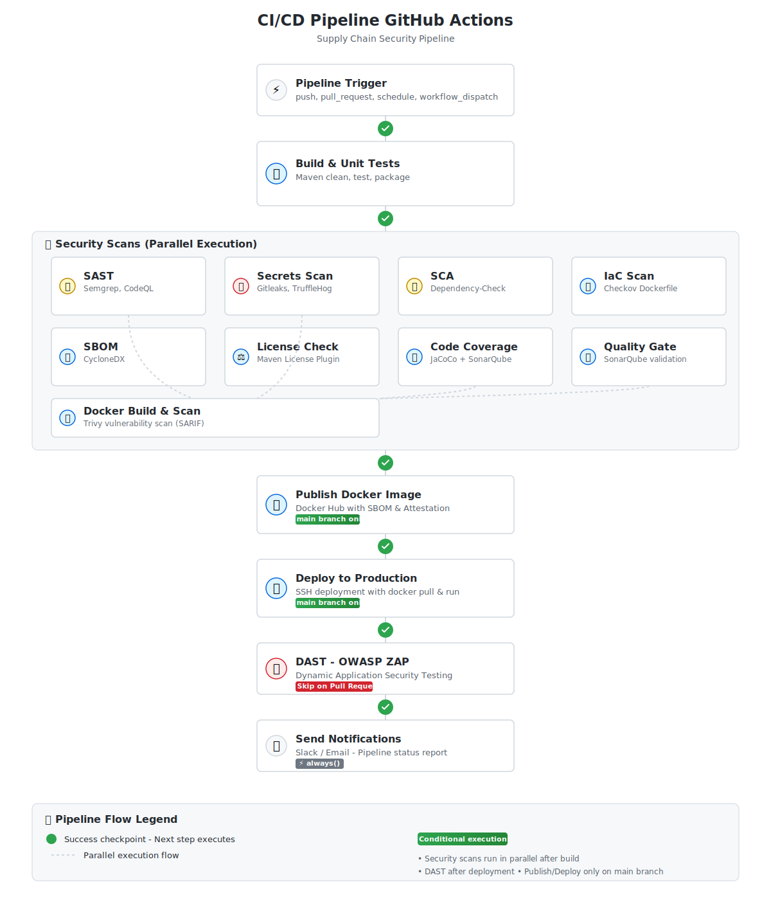

# TP : Créer un Pipeline CI/CD GitHub Actions Modulaire

## 🎯 Objectifs Pédagogiques

À la fin de ce TP, vous serez capable de :
- Créer un pipeline CI/CD modulaire avec des workflows réutilisables
- Comprendre l'architecture `workflow_call` de GitHub Actions
- Intégrer des outils de sécurité (SAST, SCA, DAST) progressivement
- Construire et déployer une application Java avec Docker
- Orchestrer plusieurs workflows avec un pipeline principal

## 📋 Prérequis

- Compte GitHub
- Projet Java/Spring Boot avec Maven
- Compte Docker Hub
- Serveur de déploiement (Ubuntu/Debian)
- Connaissance de base : Git, Docker, Java

**⚙️ Configuration Requise :**

Avant de commencer les exercices, vous devez configurer les secrets GitHub nécessaires pour le pipeline. Consultez le **[Guide de Configuration des Secrets](SECRETS.md)** pour préparer votre environnement.

## ⏱️ Durée Estimée

- **Durée totale :** 5-7 heures
- **Niveau :** Intermédiaire à Avancé

---

## 🏗️ Architecture du Pipeline

Nous allons créer une architecture **modulaire** avec :
- **1 workflow principal** (`main-pipeline.yml`) que nous allons enrichir progressivement
- **9 workflows réutilisables** que nous ajouterons un par un

### Vue d'Ensemble Visuelle



### Structure des Workflows

```
main-pipeline.yml (orchestrateur)
    ├── build-unit-tests.yml           [Exercice 2]
    ├── code-quality-sast.yml          [Exercice 3]
    ├── secret-scanning.yml            [Exercice 4]
    ├── sca-dependency-scan.yml        [Exercice 5]
    ├── secure-iac-dockerfile-scan.yml [Exercice 6]
    ├── build-docker-image.yml         [Exercice 7]
    ├── dast-dynamic-security-testing.yml [Exercice 8]
    ├── publish-docker-hub.yml         [Exercice 9]
    └── deploy-production-server.yml   [Exercice 10]
```

---

## 📚 Liste des Exercices

| # | Exercice | Durée | Fichier |
|---|----------|-------|---------|
| 1 | 🎼 Créer le Pipeline Principal (Squelette) | 20 min | [Exercice-01.md](Exercice-01.md) |
| 2 | ✅ Ajouter le Workflow de Build et Tests | 30 min | [Exercice-02.md](Exercice-02.md) |
| 3 | 🔍 Ajouter l'Analyse SAST | 45 min | [Exercice-03.md](Exercice-03.md) |
| 4 | 🔐 Ajouter la Détection de Secrets | 20 min | [Exercice-04.md](Exercice-04.md) |
| 5 | 📦 Ajouter l'Analyse des Dépendances (SCA) | 30 min | [Exercice-05.md](Exercice-05.md) |
| 6 | 🏗️ Ajouter la Sécurité IaC (Dockerfile) | 30 min | [Exercice-06.md](Exercice-06.md) |
| 7 | 🐳 Ajouter le Build et Scan Docker | 45 min | [Exercice-07.md](Exercice-07.md) |
| 8 | 🎯 Ajouter les Tests DAST | 45 min | [Exercice-08.md](Exercice-08.md) |
| 9 | 📤 Ajouter la Publication Docker Hub | 30 min | [Exercice-09.md](Exercice-09.md) |
| 10 | 🚀 Ajouter le Déploiement en Production | 45 min | [Exercice-10.md](Exercice-10.md) |
| 11 | 🔔 Ajouter les Notifications | 15 min | [Exercice-11.md](Exercice-11.md) |

**Durée totale estimée :** 5h30 - 7h

---

## 🚀 Comment Utiliser ce TP

### Étape 0 : Préparation de l'Environnement

**🔐 IMPORTANT** : Avant de commencer l'Exercice 1, configurez les secrets GitHub en suivant le **[Guide de Configuration des Secrets](SECRETS.md)**.

Cette étape est essentielle pour que les workflows puissent :
- Se connecter à Docker Hub
- Scanner les dépendances avec les bons tokens
- Déployer l'application sur votre serveur

### Approche Progressive

1. **Préparez l'environnement** : Configurez les secrets (voir [SECRETS.md](SECRETS.md))
2. **Commencez par l'Exercice 1** : Créez le squelette du pipeline
3. **Continuez dans l'ordre** : Chaque exercice s'appuie sur le précédent
4. **Testez à chaque étape** : Commitez et vérifiez que le workflow fonctionne
5. **Comprenez avant de continuer** : Lisez les questions de compréhension

### Structure de Chaque Exercice

Chaque fichier d'exercice contient :
- 🎯 **Objectif** : Ce que vous allez apprendre
- 📝 **Instructions** : Étapes détaillées avec code
- ✅ **Critères de Validation** : Comment vérifier que ça fonctionne
- 🤔 **Questions de Compréhension** : Pour valider votre apprentissage
- 🎯 **Visualisation** : Architecture du pipeline à cette étape

---

## 📊 Architecture Finale

À la fin du TP, vous aurez construit ce pipeline complet :

```
main-pipeline.yml (Orchestrateur)
│
├─[1]─ build-unit-tests.yml
│       │
│       ├─[2]─ code-quality-sast.yml ────────┐
│       ├─[3]─ secret-scanning.yml ──────────┤
│       ├─[4]─ sca-dependency-scan.yml ──────┼─[6]─ build-docker-image.yml
│       └─[5]─ secure-iac-dockerfile-scan.yml─┘       │
│                                                      │
│                                             [7]─ dast-dynamic-security-testing.yml
│                                                      │
│                                             [8]─ publish-docker-hub.yml
│                                                      │
│                                             [9]─ deploy-production-server.yml
│                                                      │
└─────────────────────────────────────────────[10]─ send-notifications
```

---

## 🎯 Compétences Acquises

### GitHub Actions
- ✅ `workflow_call` : Créer des workflows réutilisables
- ✅ `uses:` : Appeler des workflows depuis le pipeline principal
- ✅ `needs:` : Gérer les dépendances entre jobs
- ✅ `if:` : Conditions d'exécution
- ✅ `secrets: inherit` : Partager les secrets
- ✅ Exécution parallèle vs séquentielle

### DevSecOps
- ✅ SAST (Semgrep + CodeQL)
- ✅ Secret Scanning (Gitleaks)
- ✅ SCA (OWASP Dependency-Check)
- ✅ IaC Security (Checkov)
- ✅ Container Scanning (Trivy)
- ✅ DAST (OWASP ZAP)
- ✅ SBOM (Software Bill of Materials)

### Docker & Déploiement
- ✅ Build multi-stage
- ✅ Cache GitHub Actions
- ✅ Déploiement SSH
- ✅ Health checks
- ✅ Rollback strategies

---

## 📚 Ressources Complémentaires

- [Guide de Configuration des Secrets](SECRETS.md) ⚙️ **À lire en premier**
- [GitHub Actions - Reusable Workflows](https://docs.github.com/en/actions/using-workflows/reusing-workflows)
- [GitHub Actions - Workflow syntax](https://docs.github.com/en/actions/using-workflows/workflow-syntax-for-github-actions)
- [OWASP DevSecOps](https://owasp.org/www-project-devsecops-guideline/)
- [Docker Best Practices](https://docs.docker.com/develop/dev-best-practices/)

---

## 🐛 Besoin d'Aide ?

- Consultez le [Guide de Dépannage](TROUBLESHOOTING.md)
- Vérifiez les logs dans l'onglet **Actions** de GitHub
- Relisez les questions de compréhension de chaque exercice

---

**Bon courage ! 🚀**

**Version :** 3.0 (Approche Progressive)
**Dernière mise à jour :** 2025-12-03
**Auteur :** DevSecOps Team
